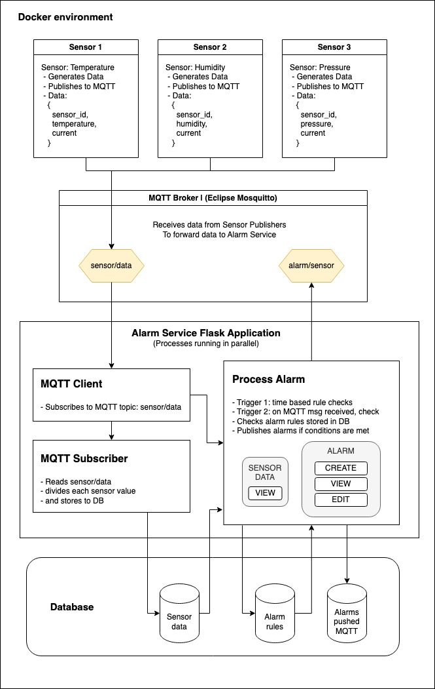

## **Project Documentation: Sensor Data Monitoring System**

Project by: Kshitij Tomar ( ✉️ : [kshtjtomar40@gmail.com](mailto:kshtjtomar40@gmail.com) / 📞 : +91-9891562247 )

### **Overview**

The Sensor Data Monitoring System is a scalable IoT-based solution for monitoring sensor data, triggering alarms based on predefined rules, and providing real-time data analytics. It utilizes MQTT for data communication, a SQLite database for data storage, and a Flask web server for managing alarms and accessing data. This documentation details the setup, usage, and development of the system, demonstrating skills in Flask development, MQTT communication, and Docker-based deployment.

### **Table of Contents**

---

## **System Architecture**

The system consists of the following main components:

1. **MQTT Broker**: Manages communication between sensor publishers and the alarms service.
2. **Sensor Publishers**: Simulated sensors generating and publishing data to the MQTT broker.
3. **Alarms Service**: A Flask application that processes sensor data according to predefined rules and triggers alarms.
4. **Database**: Stores sensor data, alarm rules, and other related information.

`Architecture Diagram`



## **Components**

### **MQTT Broker**

- **Technology**: Eclipse Mosquitto
- **Purpose**: Facilitates communication between sensor publishers and the alarms service.
- **Ports**: Default port is 1883.

### **Sensor Publishers**

- **Technology**: Python (Paho MQTT)
- **Purpose**: Simulate sensors by generating and publishing random data to the MQTT broker.
- **Sensor Types**: Temperature, humidity, and pressure, with current.

### **Alarms Service**

- **Technology**: Flask (Python)
- **Purpose**: Receives sensor data, evaluates it against alarm rules, and triggers actions if necessary.
- **Endpoints**: Provides API endpoints for managing alarm rules and accessing sensor data.

### **Database**

- **Technology**: SQLite, PostgreSQL
- **Purpose**: Stores data for sensor readings, alarm rules, and alarm actions.

## **Setup Instructions**

1. **Unzip**
    - Unzip the folder
    - Change to the directory
    
    ```bash
    cd kshitij_sensor_alarm_system
    ```
    
2. **Environment Setup**
    - Define necessary environment variables in a `.env` file or use defaults.
    - Sample `.env.dockerfile` file:
        
        ```
        # PostgreSQL environment variables
        POSTGRES_USER=user
        POSTGRES_PASSWORD=password
        POSTGRES_DB=alarms
        DB_HOST=postgres #localhost
        DB_PORT=5432
        
        # MQTT environment variables
        MQTT_BROKER=mqtt #localhost
        MQTT_PORT=1883
        
        # Alarms service specific
        DB_NAME=alarms
        
        # Flask environment variables
        FLASK_APP=app.py
        FLASK_ENV=development
        
        ```
        
3. **Docker Setup and run**
    - Start the services using Docker Compose:
        
        ```bash
        docker-compose up -d --build --force-recreate
        ```
        
        For help in installation of docker on your system, plz use reference: https://docs.docker.com/get-docker/
        
4. **Database Initialization**
    - Tables will be auto-created on the first run.

## **Database Models**

1. **SensorData**
    - `id` (Integer): Primary key for the table.
    - `sensor_id` (String): Identifier for the sensor.
    - `sensor_type` (String): Type of the sensor.
    - `value` (Float): Recorded value from the sensor.
    - `timestamp` (DateTime): Time when the data was recorded (defaults to the current time).
2. **AlarmRule**
    - `id` (Integer): Primary key for the table.
    - `sensor_id` (String): Identifier for the sensor, formatted as `sensor_id,sensor_type`.
    - `threshold_condition` (String): Condition for triggering the alarm (e.g., 'greater_than', 'less_than').
    - `threshold_value` (Float): Value against which the sensor data is compared.
    - `duration` (Integer): Time period for which the condition should be met.
    - `shunt_enabled` (Boolean): Indicates if the alarm shunting is enabled.
    - `shunt_sensor_id` (String, nullable): Identifier for the shunt sensor.
    - `shunt_threshold_condition` (String, nullable): Condition for the shunt alarm.
    - `shunt_threshold_value` (Float, nullable): Value for the shunt alarm.
    - `alarm_type` (String): Type of the alarm (e.g., 'temperature', 'humidity').
3. **AlarmPushMQTT**
    - `id` (Integer): Primary key for the table.
    - `alarm_id` (Integer): Foreign key referencing the `AlarmRule` table.
    - `timestamp` (DateTime): Time when the alarm was pushed (defaults to the current time).
    - `message` (Text): Message content of the alarm notification.

## **API Endpoints**

- **`/`**: Home page; Alarms Push list (GET)
- **`/alarm_pushes`**: Retrieve paginated alarm pushes to MQTT(GET)
- **`/alarm_rules`**: Manage alarm rules (GET, POST)
- **`/alarm_rules/[int:rule_id](notion://www.notion.so/722749d4db1e41d2996ed228734ae9f7?pvs=43&qid=)`**: View a specific alarm rule (GET)
- **`/edit_alarm/[int:alarm_id](notion://www.notion.so/722749d4db1e41d2996ed228734ae9f7?pvs=43&qid=)`**: Edit an existing alarm rule (GET, POST)
- **`/delete_alarm/[int:alarm_id](notion://www.notion.so/722749d4db1e41d2996ed228734ae9f7?pvs=43&qid=)`**: Delete an alarm rule (GET)
- **`/view_sensors`**: Show latest sensor data (GET)
- **`/sensor_data`**: Access data for a specific sensor (GET)

## **Development and Testing**

- **Local Development**
    - Run the app locally using `Flask`.
    - Use `sqlite` for local development; `postgres` is also supported.
- **Testing**
    - Implement unit tests for each component.
    - Use mock data for simulating sensor inputs.

## **Additional Sections to Consider**

1. **Security Considerations**: Discuss measures for securing data and communications.
2. **Performance Optimization**: Strategies for improving system performance and handling high data volumes.
3. **Error Handling**: How the system manages errors and exceptions.
4. **User Management**: If applicable, details on user roles, authentication, and authorization.
5. **Deployment Strategy**: Instructions for deploying on different environments (local, cloud, edge devices).
6. **Assumptions Made**:
    - The system will operate in a controlled environment with a stable network connection for MQTT and HTTP communications.
    - Sensor data will be available in a consistent format, and any preprocessing required will be minimal.
    - The gateway hardware has sufficient resources to handle the computational load and data storage needs.
7. **Corner Cases Addressed**:
    - Handling of intermittent network connectivity: Implementing retry mechanisms and local caching to ensure data consistency and availability.
    - Sensor data anomalies: Introducing data validation and anomaly detection to prevent false alarms due to erroneous data.
    - System reboot scenarios: Ensuring state persistence to maintain continuity of alarm monitoring across reboots.
- **Storage Format**:
    - Utilizes SQLite for storing sensor data, alarm rules, and alarm notifications. The choice of SQLite ensures lightweight, file-based storage suitable for edge devices.
    - File system for logging:
        - ‘_logs_mqtt_subscriber.logs’: has logs for all the incoming messages received on topic for sensors.
        - ‘_logs_processor_alarm.logs’: has logs for all the alarm based triggers that took place during the run.
- **Processing Logic**:
    - **Data Ingestion**: Subscribes to MQTT topics to receive sensor data, which is then stored in the database.
    - **Alarm Evaluation**: Periodically or trigger based evaluates incoming data against the defined alarm rules. If conditions are met, an alarm is triggered and logged.
    - **Alarm Publishing**: Alarms are published back to MQTT, with the possibility of extending to HTTP endpoints if needed.
    - **Parallel Execution**: The system supports parallel processing, leveraging multiprocessing or multithreading to handle multiple sensor data streams and alarms concurrently.

## **Conclusion**

This documentation has outlined the system's architecture, data models, API endpoints, setup instructions, and key considerations for deployment. The included logging and monitoring capabilities enable efficient troubleshooting and system performance tracking.

**The project is fully operational and in a proper working state**, successfully handling real-time data monitoring and alarm processing as designed.

## **Future Enhancements**

- **Support for Multiple Database Systems**: Including PostgreSQL, MySQL, etc.
- **Real-time Analytics Dashboard**: Visualize sensor data and alarm states.
- **Advanced Alarm Logic**: Support for more complex conditions and actions.

## ***Other links:***
- Notion page(private): https://www.notion.so/xitiz7/Alarm-system-d31a6619f9e844d4a04a8e6ea5ab0135?pvs=4
- Github (private): [https://github.com/KshitijTomar/kshitij_sensor_alarm_system](https://github.com/KshitijTomar/kshitij_sensor_alarm_system)

As the system evolves, future enhancements may include:

- **Support for Additional Database Systems**: Expanding beyond SQLite to include databases like PostgreSQL or MySQL for larger-scale deployments.
- **Advanced Analytics and Visualization**: Developing a real-time dashboard for data visualization and advanced analytics, providing deeper insights into sensor data trends and system health.
- **Enhanced Security Features**: Implementing stronger security measures, such as encryption of data in transit and at rest, and more granular access control.

---

For any questions or further information, please refer to the project repository or contact me.
